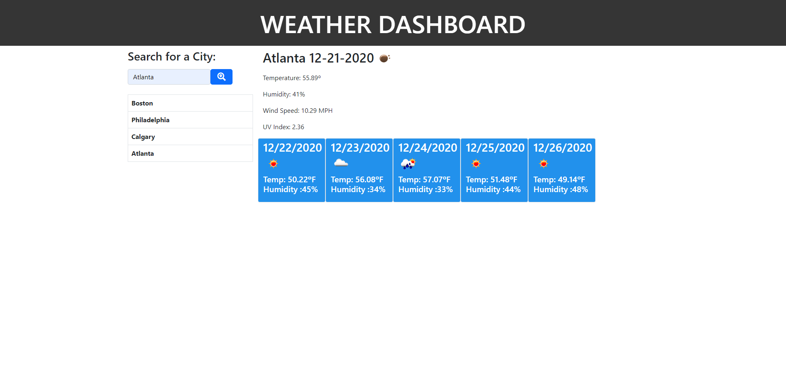

# API Weather Dashboard

## Description

The goal of this project was to create an app that utilized the OpenWeather API to display weather data to the user based on what they search for.

## Installation

All functionality of this project is contained within the deployed webpage itself.  Users can navigate to the following address to experience the project:
https://pkeld148.github.io/weather-dashboard/

## Usage

When the user navigates to the page, they will be presented with a search box where they can enter the name of a city.  After hitting the search button, the app will retrieve current weather information for that city in the main space.  Just below that, a 5-day forecast for that city will also be shown.  After a user has searched for a city, that city name will populate below the search area and the user may click on those to pull back up the weather data for that city again.

## Credits

Credits to the OpenWeather.org for their fantastic API and easy to understand documentation.

## License

Licensed under the [MIT](https://github.com/Pkeld148/weather-dashboard/blob/main/LICENSE) license.